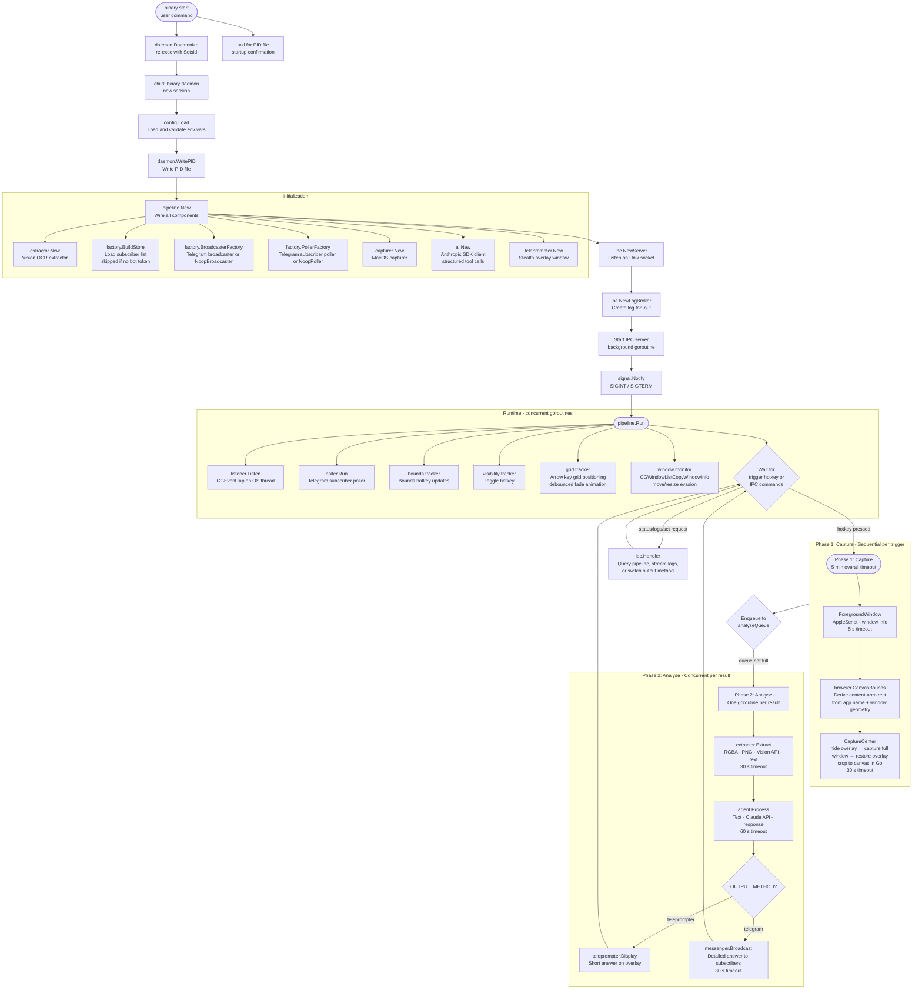
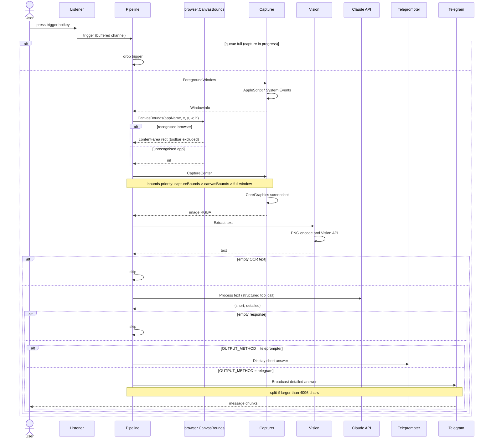
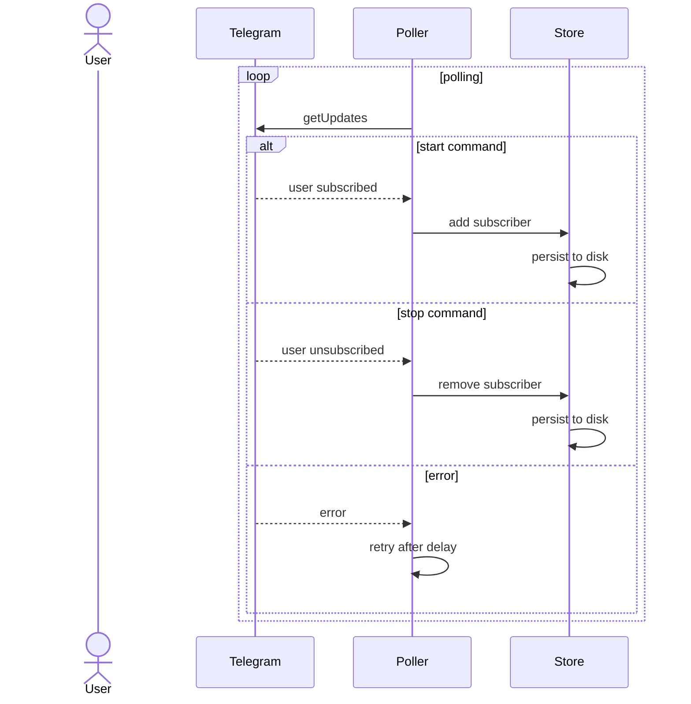

# Architecture

## CLI and Daemon Architecture

The application uses a **single binary, multiple subcommands** architecture:

**CLI Layer** (`src/cmd/`) provides user-facing commands via Cobra:

- **`daemon`** -- runs the full pipeline with IPC server (called by `start` command)
- **`start`** -- daemonizes the process by re-execing `<binary> daemon` in a new session (uses `syscall.SysProcAttr{Setsid: true}`)
- **`stop`** -- sends SIGTERM to the daemon via PID file
- **`status`** -- queries daemon status (PID, uptime, subscriber count, output method, last window) via IPC, one-shot output
- **`logs`** -- subscribes to IPC log stream and streams colorized log output to stdout
- **`restart`** -- stops and starts the daemon with config flags
- **`set`** -- updates a runtime setting on the running daemon (e.g., `output-method`)

**Daemon Lifecycle** (`src/daemon/`) handles process management:

- **PID file** -- stores daemon PID for status checks and shutdown signals (path: `$TMPDIR/<binary>-<uid>.pid`, where `<binary>` is the compiled binary name)
- **Daemonize** -- re-execs current binary with `Setsid: true` for full detachment from terminal
- Config flags are forwarded as environment variables to the re-exec'd child process

**IPC Layer** (`src/ipc/`) enables inter-process communication:

- **Unix domain socket** at `$TMPDIR/<binary>-<uid>.sock` with `0600` permissions
- **Length-prefixed JSON** wire format (4-byte big-endian length + UTF-8 JSON body)
- **Log broker** -- fan-out io.Writer that distributes slog text lines to subscribed IPC clients
- **Handler** -- dispatches IPC commands: `status`, `shutdown`, `log.subscribe`, `set` (runtime output method switching)

## Pipeline Design

The pipeline orchestrates the full workflow with a **two-phase design**:

- **Phase 1 (Capture)**: One goroutine per hotkey trigger; captures complete independently and in parallel
- **Phase 2 (Analyse)**: Results queue up and are processed concurrently (one goroutine per queued result) for OCR → AI → output routing (teleprompter or Telegram, based on `OUTPUT_METHOD`)

This separation decouples fast Phase 1 captures from slow Phase 2 analysis, preventing missed captures when the pipeline is busy.

**Modules** handle MacOS-specific operations:

- **Listener** -- global hotkey detection, bounds tracking, teleprompter toggle, grid navigation (4-direction arrow keys), opacity adjustment, and font size adjustment via `CGEventTap` (cgo). Grid/opacity/font-size key presses are isolated from bounds selection via a `gControlUsed` flag
- **Capturer** -- foreground window detection (AppleScript) and screenshot capture, using `src/bridges/core_graphics` for CoreGraphics calls. Captures the full window; canvas cropping is done in Go
- **Extractor** -- OCR text extraction interface consumed by the pipeline
- **Teleprompter** -- stealth overlay management (visibility toggle, text display) delegating to the appkit bridge

**Adapters** integrate with external services:

- **AI** -- Claude AI client using the official Anthropic Go SDK with structured tool calls returning `short` and `detailed` response branches. System prompt and tool definition use ephemeral prompt caching (configurable TTL via `ANTHROPIC_CACHE_TTL`, default 1h) to reduce cost and latency on repeated calls (package `ai`)
- **IM** -- Telegram Bot API sender with message chunking and MarkdownV2 formatting (package `im`). When `TELEGRAM_BOT_TOKEN` is absent, a `NoopBroadcaster` and `NoopPoller` are used. Output is routed to Telegram only when `OUTPUT_METHOD=telegram`
  - **Poller** -- Telegram long-polling for subscriber management (`/start`, `/stop` commands) (package `im/poller`)
  - **Store** -- plain-text file-backed persistence for subscriber chat IDs (package `im/store`)
- **OCR** -- Apple Vision framework adapter wrapping `src/bridges/vision` (package `ocr`)

**Factory** (`src/factory/`) constructs adapter implementations with noop fallbacks:

- **`store.go`** -- `BuildStore`: opens the subscriber store when `TELEGRAM_BOT_TOKEN` is set, returns nil otherwise
- **`broadcaster.go`** -- `BroadcasterFactory`: returns a live `im.Sender` or `im.NoopBroadcaster` when store is nil
- **`poller.go`** -- `PollerFactory`: returns a live `poller.Poller` (active state derived from `OUTPUT_METHOD`) or `poller.NoopPoller` when store is nil

**Bridges** separate CGo boundaries into dedicated packages:

- **`src/bridges/vision`** -- Objective-C wrapper for Apple Vision framework OCR (`visionRecognizeText`)
- **`src/bridges/core_graphics`** -- Objective-C wrappers for CoreGraphics screen capture, display queries (`captureScreenRect`, `getMainDisplayWidth`, `getMainDisplayHeight`), and window metadata (`capturedWindowPID`, `capturedWindowRect` via `CGWindowListCopyWindowInfo` — pure metadata, no screen-capture indicator)
- **`src/bridges/appkit`** -- Objective-C wrappers for AppKit overlay window (NSWindow creation, text rendering, positioning) and NSApplication run loop management
- **`src/bridges/browser`** -- Pure Go package that derives the browser content-area rectangle from window geometry, excluding the browser toolbar (address bar, tab bar). Supports Safari (74 px), Google Chrome (88 px), and Firefox (90 px). Returns nil for unrecognised apps so callers fall back to the full window

**Pipeline Components** (`src/pipeline/`) orchestrate the workflow:

- **`pipeline.go`** -- constructors and public interface (`New`, `Status`, `Run`); wires all components using `NewBuilder`
- **`builder.go`** -- Builder pattern for pipeline construction; injectable dependencies via `With*` methods and `Build()`
- **`process.go`** -- implementation of the sequential process steps (fetch window, derive canvas bounds, capture with overlay hide/restore, crop to canvas in Go, extract, process with AI, route output to teleprompter or Telegram based on `OUTPUT_METHOD`)
- **`output.go`** -- runtime output method switching (`SetOutputMethod`, `OutputMethod`, `isTeleprompterActive`); hides/shows overlay on switch; activates/deactivates the poller via `SetActive`
- **`run.go`** -- event loop and goroutine orchestration (`Run` method)
- **`tracker_bounds.go`** -- capture bounds tracker (hotkey-driven rectangle updates)
- **`tracker_toggles.go`** -- teleprompter visibility toggle tracker
- **`tracker_teleprompter_overlay_opacity.go`** -- text opacity adjustment tracker (±0.01 per step, reset to default)
- **`tracker_teleprompter_text_font_size.go`** -- font size adjustment tracker (±0.5pt per step, clamped to 5–48pt)
- **`tracker_teleprompter_grid_position.go`** -- percentage-based grid position tracker with debounced fade animation and circular wrapping
- **`tracker_window_changes.go`** -- window move/resize evasion via `CGWindowListCopyWindowInfo` polling

## Startup and Daemon Flow

Each pipeline run has an overall timeout of 5 minutes. Individual step timeouts are enforced to prevent any single operation from stalling the daemon indefinitely.

**Phase 1 and Phase 2 are independent**: Phase 1 captures complete quickly and enqueue to `analyseQueue` (capacity 5 by default). Phase 2 processes queued results concurrently—if the queue fills, new captures are dropped with a warning log, preventing unbounded memory growth.

## Sequence Diagrams

### Capture Pipeline

The sequence below shows the capture flow triggered by a hotkey press through to message delivery, including error paths for empty results and queue overflow.

### Subscription Flow

This sequence shows how Telegram subscribers are managed via `/start` and `/stop` commands, using long-polling to receive updates from the Telegram API.

## Subscriber Management

Telegram integration is optional. When `TELEGRAM_BOT_TOKEN` is not set, noop implementations are used for the broadcaster and poller. The `OUTPUT_METHOD` setting (default: `teleprompter`) controls which adapter receives AI responses; it can be switched at runtime via `lensd set output-method <telegram|teleprompter>`. When Telegram is configured, the daemon supports multiple subscribers through a dynamic subscription system:

- Users send `/start` to the Telegram bot to subscribe and receive responses
- Users send `/stop` to unsubscribe
- The subscriber list is persisted to a plain-text file (default: `tmp/subscribers`, configurable via `TELEGRAM_SUBSCRIBER_STORE_PATH`), with one chat ID per line, and survives daemon restarts
- All responses are broadcast to every active subscriber

The Telegram poller goroutine runs at startup but only actively polls when `OUTPUT_METHOD=telegram`. When telegram is not the active output method, the poller idles and subscriber commands (`/start`, `/stop`) are ignored. It resumes polling automatically when the output method switches back to telegram.

## Custom Capture Bounds

Each capture uses the first bounds available in this priority order:

1. **Custom bounds** (highest priority) — set by holding the bounds hotkey (default: `RightOption`) and moving the mouse to define a rectangular region. The daemon tracks minimum and maximum mouse coordinates while the key is held; bounds are locked on release. Bounds selection is isolated from grid/opacity controls: pressing arrow keys or +/- while the bounds key is held activates grid/opacity mode and suppresses bounds recording for that keypress session.
2. **Canvas crop** — when the focused application is a recognised browser (Safari, Chrome, Firefox), the full window is captured first, then cropped in Go to the content-area rectangle (subtracting the browser toolbar height: Safari 74 px, Chrome 88 px, Firefox 90 px). This gives Vision OCR a focused image without toolbar chrome. Canvas bounds are also used for teleprompter grid positioning (independent of capture).
3. **Full window** (fallback) — when neither custom bounds are set nor a browser is recognised, the entire active window is captured.

The overlay is hidden synchronously (`orderOut`) before each screen capture and restored after, ensuring the teleprompter does not appear in the captured image.

While the bounds key is held, **arrow keys** navigate the teleprompter on a percentage-based grid (configurable step via `TELEPROMPTER_GRID_STEP`, default 1%). **Minus/plus keys** adjust the text opacity by ±0.01 per step (clamped to 0.0–1.0). **0** resets opacity to the configured default. **Comma/period keys** adjust the font size by ±0.5pt per step (clamped to 5–48pt).

For fullscreen windows (width and height >= screen dimensions), the daemon captures the entire display.

## Teleprompter Overlay

The teleprompter is a stealth macOS overlay window positioned within the captured window's content area:

- **Excluded from screen sharing** via `NSWindowSharingNone` — invisible to Zoom, QuickTime, and all capture pipelines
- **Excluded from Mission Control, Cmd+Tab, and Dock** via accessory activation policy and collection behavior flags
- **Click-through** — does not intercept mouse events
- **Configurable appearance** — font family, weight, size, opacity, alignment, adaptive color, and fade duration via environment variables
- **Adaptive text color** — when enabled (`TELEPROMPTER_ADAPTIVE_COLOR=true`), the overlay captures the background behind the text strip on each text update, inverts every pixel via `kCGBlendModeDifference`, and uses the result as the text color pattern so each glyph pixel contrasts with whatever is beneath it. Sampling is event-gated (on `Display(text)` calls, which co-time with the OCR hotkey) rather than periodic
- **Fade animations** — show, hide, and text updates cross-fade with configurable duration (`TELEPROMPTER_FADE_DURATION`). Animation cancellation uses a generation counter to avoid stale completions
- **Percentage-based grid positioning** — hold bounds key + arrow keys to move the teleprompter by `TELEPROMPTER_GRID_STEP` (default 1%) per press. Position wraps circularly. Initial position configurable via `TELEPROMPTER_GRID_INITIAL_COL`/`TELEPROMPTER_GRID_INITIAL_ROW`. Rapid presses debounce: first press fades out, subsequent presses extend the timer, timer fires repositions and fades in
- **Dynamic text alignment** — `TELEPROMPTER_ALIGNMENT=dynamic` (default) adapts alignment based on grid column: left-aligned at left edge, right-aligned at right edge, centered elsewhere. Also accepts `left`, `center`, `right` for fixed alignment
- **Window evasion** — polls the captured window's bounds via `CGWindowListCopyWindowInfo` (metadata only, no screen-capture indicator) at `TELEPROMPTER_WINDOW_MONITOR_INTERVAL` (default 200ms). When the window moves or resizes, the teleprompter fades out. After the window stabilises for `TELEPROMPTER_WINDOW_STABILIZE_DELAY` (default 500ms), the teleprompter recalculates canvas bounds, repositions at the current grid spot, and fades back in. Tracks by PID so switching to a different app does not affect the teleprompter
- **Opacity model** — text opacity (`gTextOpacity`, controlled by hotkey +/−) and overlay visibility (`gOverlayInterpolation`, controlled by animations) are independent. Text opacity is baked into the text color alpha / adaptive color pattern. Window alpha is driven by the interpolation (0→1 for fade-in, 1→0 for fade-out)
- **Runtime opacity adjustment** — hold bounds key + minus/plus keys to decrease/increase text opacity by 0.01 per step. Press 0 to reset to the configured default
- **Runtime font size adjustment** — hold bounds key + comma/period keys to decrease/increase font size by 0.5pt per step (clamped to 5–48pt)
- **Toggle visibility** — press the configured toggle hotkey (default: `RightCommand`) to show/hide with fade animation. Toggle during a grid move defers the visual change to the move's completion handler

The AppKit run loop runs on the main OS thread (pinned via `runtime.LockOSThread`). All daemon logic runs in background goroutines. Window operations are dispatched to the main thread via a channel-based work queue pumped at ~60 Hz.

## Key Design Decisions

- **CGEventTap in listen-only mode**: The event tap observes keyboard and mouse events without modifying or consuming them. Other applications continue to receive all events normally. On shutdown, the listener disables the tap and releases all C resources before the goroutine exits.
- **Non-blocking hotkey channel**: The C callback sends to a buffered channel with a non-blocking select, ensuring the `CFRunLoop` is never stalled by a slow pipeline execution.
- **Two-phase pipeline**: Phase 1 captures are unbounded per trigger (responsive to rapid hotkeys). Phase 2 processes queued results concurrently (one goroutine per result) but bounded by `analyseQueue` capacity (5 by default). If the queue is full, captures are dropped with a warning log.
- **In-memory image pipeline**: Images flow as `*image.RGBA` through the pipeline and are PNG-encoded into a byte buffer only when passed to the Vision API. No files are created at any point.
- **Atomic subscriber persistence**: The subscriber store writes to a temporary file and uses `os.Rename()` for atomic updates, protected by a read-write mutex for concurrent access.
- **MarkdownV2 formatting**: All Telegram messages are converted to MarkdownV2 format, escaping special characters for proper rendering.
- **Message chunking**: Telegram's 4096-character message limit is handled by splitting at rune boundaries (respecting Unicode character width) and sending sequential chunks. Rate-limited responses (HTTP 429) are retried with the server-specified backoff.
