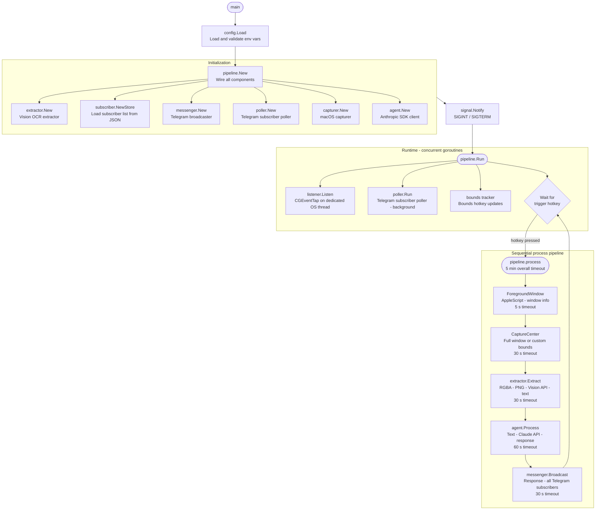

# Architecture

## Pipeline Design

The application follows a clean layered architecture with interface-based design, separating concerns into modules (platform-specific capabilities) and adapters (external service integrations), orchestrated by a central pipeline.

**Modules** handle macOS-specific operations:
- **Listener** -- global hotkey detection and bounds tracking via `CGEventTap` (cgo)
- **Capturer** -- foreground window detection (AppleScript) and screenshot capture
- **Extractor** -- OCR text extraction interface consumed by the pipeline

**Adapters** integrate with external services:
- **Agent** -- Claude AI client using the official Anthropic Go SDK
- **Messenger** -- Telegram Bot API sender with message chunking and MarkdownV2 formatting
- **Poller** -- Telegram long-polling for subscriber management (`/start`, `/stop` commands)
- **Subscriber Store** -- JSON-backed persistence for subscriber chat IDs
- **Vision** -- Objective-C bridge to Apple's Vision framework for OCR

**Pipeline** orchestrates the full workflow, wiring all components together at startup and processing each hotkey trigger through the sequential capture-OCR-AI-Telegram flow.

## Pipeline Flow

Each pipeline run has an overall timeout of 5 minutes. Individual step timeouts are enforced to prevent any single operation from stalling the daemon indefinitely.

## Subscriber Management

The daemon supports multiple Telegram subscribers through a dynamic subscription system:

- Users send `/start` to the Telegram bot to subscribe and receive responses
- Users send `/stop` to unsubscribe
- The subscriber list is persisted to a plain-text file (default: `tmp/subscribers`), with one chat ID per line, and survives daemon restarts
- All responses are broadcast to every active subscriber

The Telegram poller runs in the background, long-polling for updates with a 30-second timeout and 5-second retry backoff on errors.

## Custom Capture Bounds

By default, the daemon captures the entire active window. You can override this with custom screen-coordinate bounds:

1. **Hold the configured bounds hotkey** (default: `RightOption`, customizable via `HOTKEY_BOUNDS_KEYNAME`) and move your mouse to define a rectangular region
2. The daemon tracks the minimum and maximum coordinates of your mouse movement while the key is held
3. **Release the bounds hotkey** to lock in the bounds
4. All subsequent captures will use the custom bounds instead of capturing the full window

For fullscreen windows (width and height >= screen dimensions), the daemon captures the entire display.

## Key Design Decisions

- **CGEventTap in listen-only mode**: The event tap observes keyboard and mouse events without modifying or consuming them. Other applications continue to receive all events normally. On shutdown, the listener disables the tap and releases all C resources before the goroutine exits.
- **Non-blocking hotkey channel**: The C callback sends to a buffered channel with a non-blocking select, ensuring the `CFRunLoop` is never stalled by a slow pipeline execution.
- **Async worker processing**: A dedicated worker goroutine processes captures sequentially (limited to 1 concurrent run) while the main loop stays responsive to new hotkey triggers. If the queue is full, additional triggers are silently dropped.
- **In-memory image pipeline**: Images flow as `*image.RGBA` through the pipeline and are PNG-encoded into a byte buffer only when passed to the Vision API. No files are created at any point.
- **Atomic subscriber persistence**: The subscriber store writes to a temporary file and uses `os.Rename()` for atomic updates, protected by a read-write mutex for concurrent access.
- **MarkdownV2 formatting**: All Telegram messages are converted to MarkdownV2 format, escaping special characters for proper rendering.
- **Message chunking**: Telegram's 4096-character message limit is handled by splitting at rune boundaries (respecting Unicode character width) and sending sequential chunks. Rate-limited responses (HTTP 429) are retried with the server-specified backoff.
