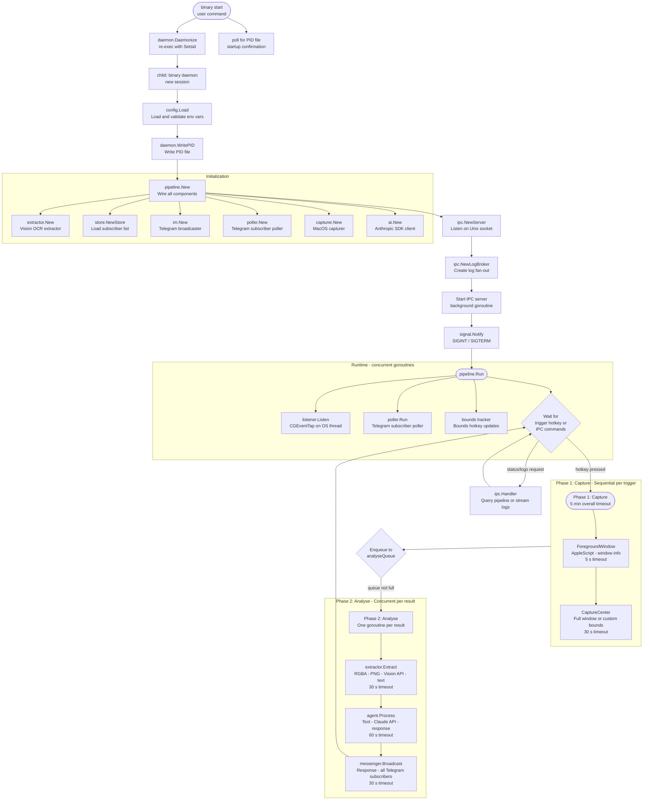
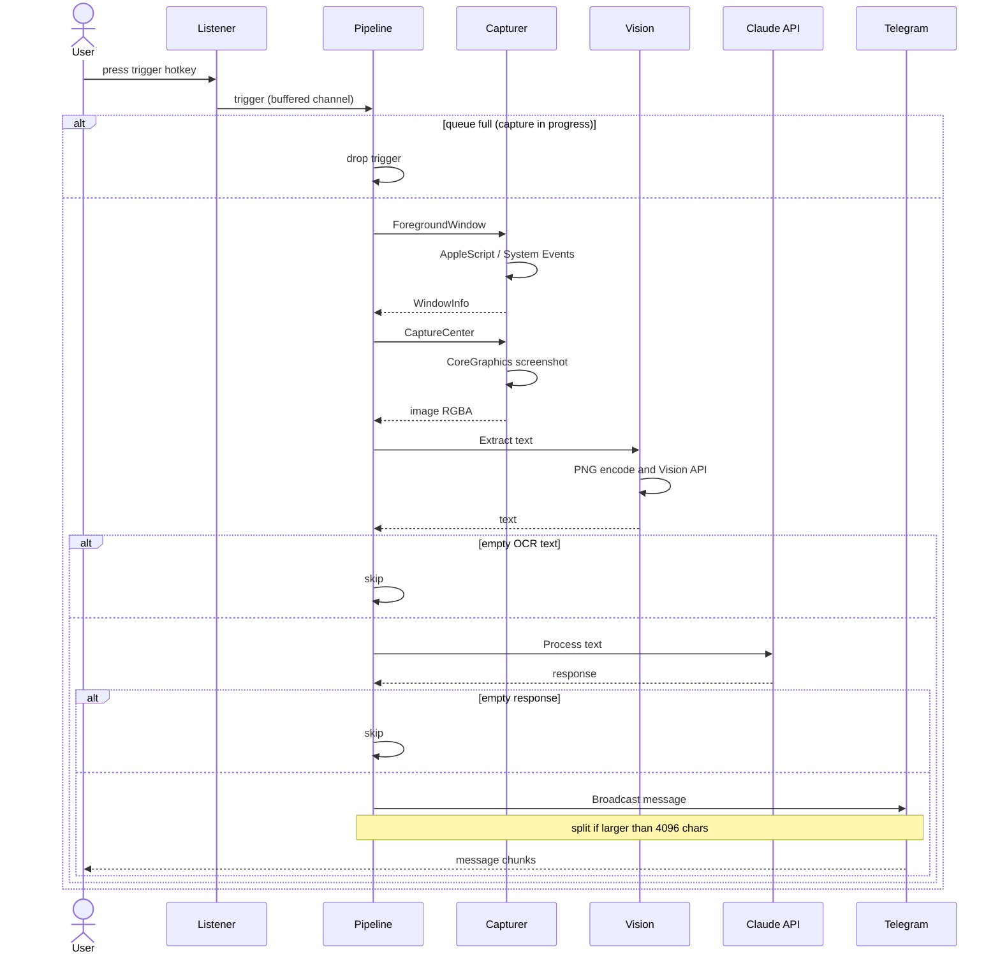
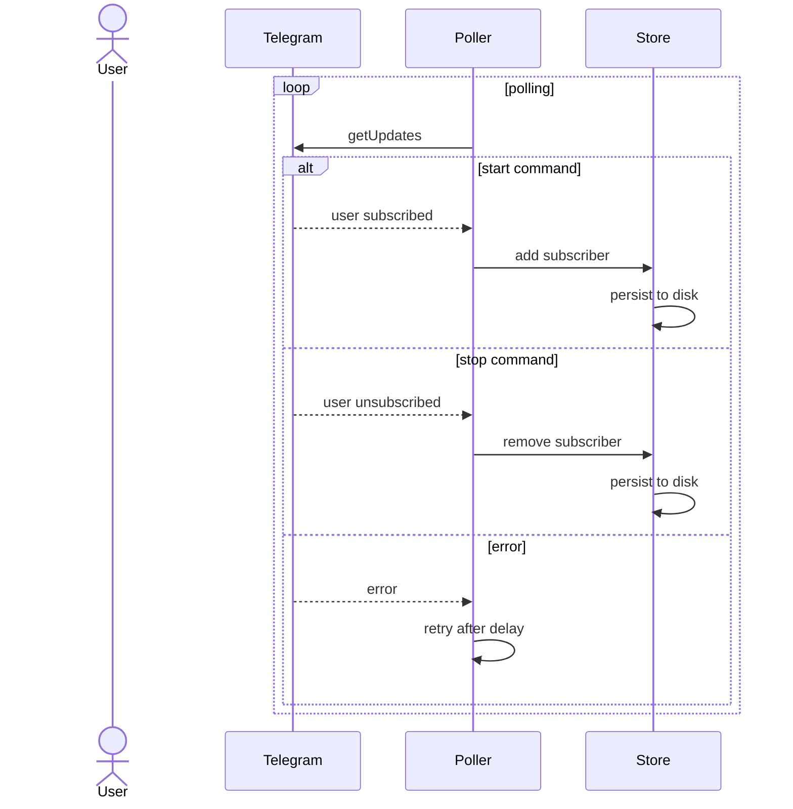

# Architecture

## CLI and Daemon Architecture

The application uses a **single binary, multiple subcommands** architecture:

**CLI Layer** (`src/cmd/`) provides user-facing commands via Cobra:

- **`daemon`** -- runs the full pipeline with IPC server (called by `start` command)
- **`start`** -- daemonizes the process by re-execing `<binary> daemon` in a new session (uses `syscall.SysProcAttr{Setsid: true}`)
- **`stop`** -- sends SIGTERM to the daemon via PID file
- **`status`** -- queries daemon status (PID, uptime, subscriber count, last window) via IPC, one-shot output
- **`logs`** -- subscribes to IPC log stream and streams colorized log output to stdout
- **`restart`** -- stops and starts the daemon with config flags

**Daemon Lifecycle** (`src/daemon/`) handles process management:

- **PID file** -- stores daemon PID for status checks and shutdown signals (path: `$TMPDIR/<binary>-<uid>.pid`, where `<binary>` is the compiled binary name)
- **Daemonize** -- re-execs current binary with `Setsid: true` for full detachment from terminal
- Config flags are forwarded as environment variables to the re-exec'd child process

**IPC Layer** (`src/ipc/`) enables inter-process communication:

- **Unix domain socket** at `$TMPDIR/<binary>-<uid>.sock` with `0600` permissions
- **Length-prefixed JSON** wire format (4-byte big-endian length + UTF-8 JSON body)
- **Log broker** -- fan-out io.Writer that distributes slog text lines to subscribed IPC clients
- **Handler** -- dispatches IPC commands: `status`, `shutdown`, `log.subscribe`

## Pipeline Design

The pipeline orchestrates the full workflow with a **two-phase design**:

- **Phase 1 (Capture)**: One goroutine per hotkey trigger; captures complete independently and in parallel
- **Phase 2 (Analyse)**: Results queue up and are processed concurrently (one goroutine per queued result) for OCR-AI-Telegram

This separation decouples fast Phase 1 captures from slow Phase 2 analysis, preventing missed captures when the pipeline is busy.

**Modules** handle MacOS-specific operations:

- **Listener** -- global hotkey detection and bounds tracking via `CGEventTap` (cgo)
- **Capturer** -- foreground window detection (AppleScript) and screenshot capture, using `src/bridges/core_graphics` for CoreGraphics calls
- **Extractor** -- OCR text extraction interface consumed by the pipeline

**Adapters** integrate with external services:

- **AI** -- Claude AI client using the official Anthropic Go SDK (package `ai`)
- **IM** -- Telegram Bot API sender with message chunking and MarkdownV2 formatting (package `im`)
  - **Poller** -- Telegram long-polling for subscriber management (`/start`, `/stop` commands) (package `im/poller`)
  - **Store** -- plain-text file-backed persistence for subscriber chat IDs (package `im/store`)
- **OCR** -- Apple Vision framework adapter wrapping `src/bridges/vision` (package `ocr`)

**Bridges** separate CGo boundaries into dedicated packages:

- **`src/bridges/vision`** -- Objective-C wrapper for Apple Vision framework OCR (`visionRecognizeText`)
- **`src/bridges/core_graphics`** -- Objective-C wrappers for CoreGraphics screen capture and display queries (`captureScreenRect`, `getMainDisplayWidth`, `getMainDisplayHeight`)

**Pipeline Components** (`src/pipeline/`) orchestrate the workflow:

- **`pipeline.go`** -- constructors and public interface (`New`, `NewWithDependencies`, `Status`, `Run`)
- **`process.go`** -- implementation of the five sequential process steps (fetch window, capture, extract, process with AI, broadcast)
- **`run.go`** -- event loop and goroutine orchestration (`Run` method)

## Startup and Daemon Flow

Each pipeline run has an overall timeout of 5 minutes. Individual step timeouts are enforced to prevent any single operation from stalling the daemon indefinitely.

**Phase 1 and Phase 2 are independent**: Phase 1 captures complete quickly and enqueue to `analyseQueue` (capacity 5 by default). Phase 2 processes queued results concurrently—if the queue fills, new captures are dropped with a warning log, preventing unbounded memory growth.

## Sequence Diagrams

### Capture Pipeline

The sequence below shows the capture flow triggered by a hotkey press through to message delivery, including error paths for empty results and queue overflow.

### Subscription Flow

This sequence shows how Telegram subscribers are managed via `/start` and `/stop` commands, using long-polling to receive updates from the Telegram API.

## Subscriber Management

The daemon supports multiple Telegram subscribers through a dynamic subscription system:

- Users send `/start` to the Telegram bot to subscribe and receive responses
- Users send `/stop` to unsubscribe
- The subscriber list is persisted to a plain-text file (default: `tmp/subscribers`), with one chat ID per line, and survives daemon restarts
- All responses are broadcast to every active subscriber

The Telegram poller runs in the background, long-polling for updates with a 30-second timeout and 5-second retry backoff on errors.

## Custom Capture Bounds

By default, the daemon captures the entire active window. You can override this with custom screen-coordinate bounds:

1. **Hold the configured bounds hotkey** (default: `RightOption`, customizable via `HOTKEY_BOUNDS_KEYNAME`) and move your mouse to define a rectangular region
2. The daemon tracks the minimum and maximum coordinates of your mouse movement while the key is held
3. **Release the bounds hotkey** to lock in the bounds
4. All subsequent captures will use the custom bounds instead of capturing the full window

For fullscreen windows (width and height >= screen dimensions), the daemon captures the entire display.

## Key Design Decisions

- **CGEventTap in listen-only mode**: The event tap observes keyboard and mouse events without modifying or consuming them. Other applications continue to receive all events normally. On shutdown, the listener disables the tap and releases all C resources before the goroutine exits.
- **Non-blocking hotkey channel**: The C callback sends to a buffered channel with a non-blocking select, ensuring the `CFRunLoop` is never stalled by a slow pipeline execution.
- **Two-phase pipeline**: Phase 1 captures are unbounded per trigger (responsive to rapid hotkeys). Phase 2 processes queued results concurrently (one goroutine per result) but bounded by `analyseQueue` capacity (5 by default). If the queue is full, captures are dropped with a warning log.
- **In-memory image pipeline**: Images flow as `*image.RGBA` through the pipeline and are PNG-encoded into a byte buffer only when passed to the Vision API. No files are created at any point.
- **Atomic subscriber persistence**: The subscriber store writes to a temporary file and uses `os.Rename()` for atomic updates, protected by a read-write mutex for concurrent access.
- **MarkdownV2 formatting**: All Telegram messages are converted to MarkdownV2 format, escaping special characters for proper rendering.
- **Message chunking**: Telegram's 4096-character message limit is handled by splitting at rune boundaries (respecting Unicode character width) and sending sequential chunks. Rate-limited responses (HTTP 429) are retried with the server-specified backoff.
